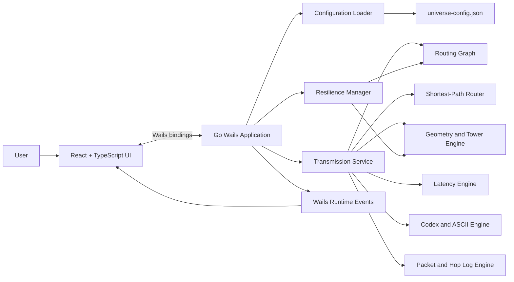
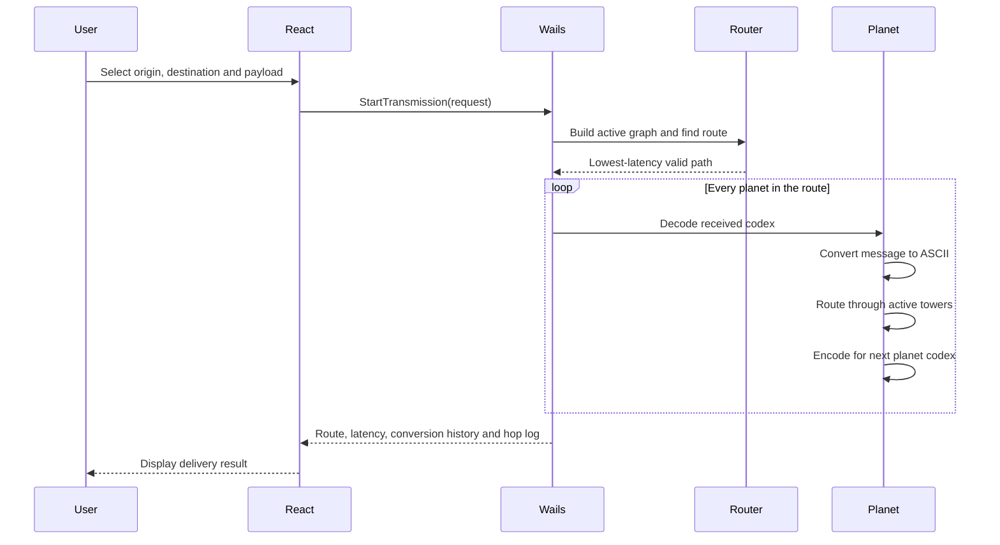

# AlchemiX — Relic Ring Protocol

> A failure-resilient, latency-aware interplanetary routing simulator for the **LAUNCH26 Relic Ring Protocol Challenge**.

AlchemiX rebuilds communication across the fictional **Zeta-26 star system** after the collapse of the zero-latency Aether-Net. The system uses the surviving Relic Ring infrastructure: planetary tower rings, underground fiber links, and laser-based void transmission.

The application calculates physically informed transmission latency, converts messages between incompatible planetary number systems, finds efficient multi-hop routes, and reroutes traffic when planets, links, or towers fail.

---

## Table of Contents

- [Project Overview](#project-overview)
- [Key Features](#key-features)
- [Technology Stack](#technology-stack)
- [System Architecture](#system-architecture)
- [How the Protocol Works](#how-the-protocol-works)
- [Routing and Resilience](#routing-and-resilience)
- [Latency Model](#latency-model)
- [Data Translation](#data-translation)
- [Tower Model](#tower-model)
- [Project Structure](#project-structure)
- [Configuration](#configuration)
- [Getting Started](#getting-started)
- [Running with Wails](#running-with-wails)
- [Running with Docker](#running-with-docker)
- [Building the Application](#building-the-application)
- [Testing](#testing)
- [Desktop Features](#desktop-features)
- [Backend Methods](#backend-methods)
- [Demonstration Guide](#demonstration-guide)
- [Troubleshooting](#troubleshooting)
- [Known Limitations](#known-limitations)
- [Team](#team)
- [Acknowledgements](#acknowledgements)
- [License](#license)

---

## Project Overview

The Zeta-26 star system previously depended on the Aether-Net, a quantum communication system with instant transmission. After the Hyper-Flare destroyed its quantum alignment, the planets were forced to use an older physical network called the **Relic Ring**.

The Relic Ring introduces real communication constraints:

- Signals take time to travel through planetary atmospheres.
- Laser transmissions are limited by the speed of light.
- Fiber communication inside a planet travels below light speed.
- Every routing tower introduces processing delay.
- Each planet uses a different numerical base, called a **codex**.
- A void hop cannot exceed the configured maximum distance.
- Planets, links, and individual towers may fail.

AlchemiX models these conditions and provides an interactive desktop control centre for sending packets, inspecting routes, observing conversions, and testing network resilience.

---

## Key Features

### Universe Simulation

- Loads all planets and physical constants from `universe-config.json`.
- Avoids hardcoded planetary coordinates, radii, codices, and tower counts.
- Displays the full Zeta-26 topology as an interactive map.
- Shows online, offline, selected, and routed planets visually.

### Intelligent Routing

- Builds a graph from currently available planets and links.
- Rejects void hops that exceed the maximum allowed distance.
- Calculates latency-aware edge weights.
- Finds an efficient valid route using a shortest-path algorithm.
- Supports direct and multi-hop packet delivery.

### Codex Translation

- Converts message characters to ASCII values.
- Encodes ASCII values using the receiving planet's codex.
- Serializes encoded values for void transmission.
- Decodes the message at every receiving planet.
- Converts the message again for the next hop.
- Shows a per-character conversion history for every planet in the route.

### Physical Latency Calculation

- Atmospheric refraction delay.
- Void propagation delay.
- Internal planetary fiber delay.
- Tower processing delay.
- Per-hop and total end-to-end latency breakdown.

### Failure Simulation

- Disable and restore complete planets.
- Break and restore links between planets.
- Disable and restore individual towers.
- Exclude failed components from route and tower calculations.
- Recalculate the next transmission using the remaining network.
- Reset the complete network to its initial state.

### Visual Monitoring

- Animated active route.
- Selected-route display.
- Tower status indicators.
- Central tower inspector.
- Packet delivery result.
- Conversion history.
- Ordered hop log.
- Live network event stream.

---

## Technology Stack

### Frontend

| Technology | Purpose |
|---|---|
| **React** | Component-based desktop user interface |
| **TypeScript** | Type-safe frontend development |
| **Vite** | Frontend development and production bundling |
| **CSS3** | Responsive cyber-futuristic interface and animations |
| **SVG** | Universe topology, planets, links, and tower rendering |
| **Lucide React** | Interface icons |
| **Wails JavaScript Bindings** | Communication between React and Go |

### Backend

| Technology | Purpose |
|---|---|
| **Go** | Routing, simulation, encoding, latency, and failure logic |
| **Wails v2** | Native desktop runtime connecting Go with React |
| **Go Modules** | Dependency management |
| **Go Standard Library** | JSON parsing, mathematics, collections, errors, and concurrency-safe state |

### Routing and Simulation

| Component | Responsibility |
|---|---|
| **Graph Model** | Represents valid planets and void links |
| **Shortest-Path Routing** | Selects the lowest-cost available route |
| **Geometry Engine** | Calculates distances and tower positions |
| **Latency Engine** | Calculates planet and void delays |
| **Codex Engine** | Converts ASCII values between planetary bases |
| **Packet Engine** | Maintains packet state and ordered hop logs |
| **Resilience Manager** | Stores disabled nodes, links, and towers |

### Desktop and Build Tools

| Technology | Purpose |
|---|---|
| **Wails CLI** | Development server and native desktop builds |
| **Native WebView** | Renders the React interface inside the desktop application |
| **npm** | Frontend package management |
| **Git and GitHub** | Version control and collaboration |

### Containerization

| Technology | Purpose |
|---|---|
| **Docker** | Reproducible service images |
| **Docker Compose** | Starts the orchestrator and distributed planet services together |
| **Multi-container Architecture** | Represents independent network services and failure scenarios |

### Configuration and Data

| Technology | Purpose |
|---|---|
| **JSON** | Dynamic universe configuration |
| **In-memory State** | Stores runtime node, link, and tower failure state |

The current simulator does not require a database. The universe is loaded from JSON, while temporary network state is maintained in memory.

---

## System Architecture



### Main Runtime Flow



---

## How the Protocol Works

1. The application loads `universe-config.json`.
2. Each planet becomes a graph node.
3. The geometry engine checks which planet pairs can form valid void hops.
4. Failed planets, links, and towers are removed from the current calculation.
5. The router finds the lowest-cost path between the selected origin and destination.
6. The packet is created with its origin, destination, payload, current planet, and hop log.
7. At each planet:
   - The received codex values are decoded.
   - The message is represented as ASCII for internal routing.
   - The packet travels between the selected entry and exit towers.
   - The message is encoded using the next planet's codex.
   - The encoded data is serialized for void transmission.
   - The hop result is appended to the ordered hop log.
8. At the destination, the final codex values are decoded back into the original text.
9. The frontend displays the route, latency, delivery result, conversion history, and hop log.

---

## Routing and Resilience

### Valid Void Links

A link is available only when:

- Both planets are active.
- The specific link has not been disabled.
- The calculated void distance does not exceed `max_void_hop_distance_km`.
- A valid operational sending tower and receiving tower can be selected.

### Route Selection

The routing layer uses a weighted graph. Each valid interplanetary hop receives a cost based on its calculated transmission latency. The shortest-path router selects the route with the lowest total cost among the currently available components.

### Dynamic Failure State

The resilience layer maintains sets of:

- Disabled planet IDs.
- Disabled undirected planet links.
- Disabled tower indices for each planet.

After a failure is introduced, the next packet is routed using the updated network state.

### Supported Failure Actions

```text
Disable planet  -> removes the planet from routing
Disable link    -> removes the selected edge
Disable tower   -> excludes that tower from entry, exit and ring routing
Reset network   -> clears all failure state
```

---

## Latency Model

All physical constants must be read from `universe_metadata` in the JSON configuration.

### 1. Void Distance

```math
L = \sqrt{(x_2-x_1)^2+(y_2-y_1)^2}\times S-(R_1+h_1)-(R_2+h_2)
```

Where:

- `x1, y1` and `x2, y2` are planet coordinates.
- `S` is `coordinate_scale_unit_km`.
- `R1` and `R2` are planet radii.
- `h1` and `h2` are atmosphere thicknesses.

### 2. Void Travel Time

```math
T_v = \frac{(h_1n_1)+(h_2n_2)+L}{C}
```

Where:

- `n1` and `n2` are refraction indices.
- `C` is `speed_of_light_kms`.

### 3. Internal Planet Transit Time

```math
T_p = \frac{2\pi r\times s}{N\times f\times C}+m\times\Delta t
```

Where:

- `r` is the planet radius.
- `N` is the total tower count.
- `s` is the number of ring segments traversed.
- `f` is `fiber_speed_fraction`.
- `m` is the number of distinct towers processed.
- `Δt` is `tower_processing_delay_ms`.

The implementation normalizes time units before combining propagation time and processing delay.

### 4. Total Route Latency

```math
Total\ Latency = \sum_{i=1}^{k}T_p(P_i)+\sum_{i=1}^{k-1}T_v(P_i,P_{i+1})
```

This produces:

- Planet fiber latency.
- Tower processing latency.
- Atmospheric latency.
- Void latency.
- Total end-to-end latency.

---

## Data Translation

Every planet uses a different numerical base called a **codex**.

### Translation Pipeline

```text
Raw text
   ↓
ASCII decimal values
   ↓
Next planet codex values
   ↓
Serialized binary stream
   ↓
Receiving planet codex values
   ↓
ASCII decimal values
   ↓
Readable local text
```

### Example

For the character `H`:

```text
ASCII decimal: 72
Base 5:        242
Base 8:        110
Base 14:       52
Base 16:       48
```

At an intermediate planet, the packet is first decoded into ASCII for local processing and then encoded using the codex of the next destination.

The desktop application displays this history per planet and per character.

---

## Tower Model

- Every planet contains `active_towers` towers.
- Towers are evenly distributed around the planetary ring.
- Tower `0` begins at the top of the planet.
- Tower indices increase clockwise.
- The geometry engine selects operational entry and exit towers.
- Disabled towers are excluded from the calculation.
- Internal traffic follows an operational path around the ring.
- Each distinct tower processed adds the configured tower delay.

The tower inspector uses:

- **Green** for active towers.
- **Red** for inactive towers.

Selecting a planet opens the tower inspector in the centre of the universe topology panel.

---

## Project Structure

```text
AlchemiX/
├── app.go                         # Wails application methods
├── main.go                        # Desktop application entry point
├── go.mod                         # Go module definition
├── go.sum                         # Go dependency checksums
├── wails.json                     # Wails project configuration
├── universe-config.json           # Zeta-26 universe definition
├── Dockerfile                     # Container image definition
├── docker-compose.yml             # Multi-service environment
│
├── internal/
│   ├── config/                    # JSON loading and validation
│   ├── domain/                    # Shared domain models
│   ├── encoding/                  # ASCII, codex and binary conversion
│   ├── geometry/                  # Distances and tower positions
│   ├── latency/                   # Physical latency calculations
│   ├── packet/                    # Packet models and hop logs
│   ├── resilience/                # Node, link and tower failure state
│   ├── routing/                   # Graph and shortest-path routing
│   └── service/                   # Transmission orchestration
│
├── frontend/
│   ├── package.json               # Frontend dependencies and scripts
│   ├── package-lock.json          # Locked npm dependency versions
│   ├── vite.config.ts             # Vite configuration
│   ├── index.html                 # Frontend HTML entry point
│   ├── src/
│   │   ├── App.tsx                # Main interface and application state
│   │   ├── styles.css             # Complete application styling
│   │   ├── types/                 # TypeScript application types
│   │   └── components/
│   │       ├── UniverseMap.tsx     # Interactive SVG topology
│   │       ├── TowerInspector.tsx  # Tower status and planet details
│   │       ├── ConversionHistory.tsx
│   │       ├── LatencyPanel.tsx
│   │       └── HopLogTable.tsx
│   └── wailsjs/                   # Auto-generated Go bindings
│
├── build/                         # Wails build configuration and output
└── README.md
```

> The exact directory names may vary slightly between branches. Keep this section synchronized with the final repository structure.

---

## Configuration

The simulator reads the universe from `universe-config.json`.

### Metadata Schema

```json
{
  "universe_metadata": {
    "system_name": "Zeta-26",
    "speed_of_light_kms": 300000.0,
    "max_void_hop_distance_km": 50000000.0,
    "coordinate_scale_unit_km": 100000.0,
    "tower_processing_delay_ms": 7.0,
    "fiber_speed_fraction": 0.67
  }
}
```

### Planet Schema

```json
{
  "id": "Aegis",
  "codex": 8,
  "x": 0.0,
  "y": 0.0,
  "radius_km": 6371.0,
  "active_towers": 8,
  "atmosphere_thickness_km": 120.0,
  "refraction_index": 1.0003
}
```

### Planet Fields

| Field | Description |
|---|---|
| `id` | Unique planet name |
| `codex` | Number base used for receiving data |
| `x`, `y` | Position in the abstract universe grid |
| `radius_km` | Planet radius in kilometres |
| `active_towers` | Number of towers on the ring |
| `atmosphere_thickness_km` | Atmospheric shell thickness |
| `refraction_index` | Atmospheric refraction coefficient |

### Configuration Rules

- Planet IDs must be unique.
- Codex values must be valid for the codec implementation.
- Tower counts must be positive.
- Radii and atmosphere thicknesses cannot be negative.
- Universe constants must use consistent units.
- Planet coordinates are scaled using `coordinate_scale_unit_km`.
- Planet radii are already expressed in kilometres and must not be scaled again.

---

## Getting Started

### Prerequisites

Install the following tools:

- **Go** — use the version declared in `go.mod` or a compatible newer version.
- **Node.js LTS** and **npm**.
- **Wails CLI v2**.
- **Git**.
- **Docker Desktop** with Docker Compose v2 for container mode.
- Platform-specific Wails/WebView build dependencies.

### Clone the Repository

```bash
git clone https://github.com/Team-AlchemiX-LAUNCH-26/AlchemiX.git
cd AlchemiX
```

### Install Go Dependencies

```bash
go mod download
```

### Install Frontend Dependencies

```bash
cd frontend
npm install
cd ..
```

### Confirm the Project Builds

```bash
go test ./...
```

```bash
cd frontend
npm run build
cd ..
```

---

## Running with Wails

Run the native desktop application in development mode:

```bash
wails dev
```

Wails will:

1. Start the Go backend.
2. Start the frontend development server.
3. Generate or refresh frontend bindings when required.
4. Open the application as a desktop window.
5. Reload the interface when frontend files change.

### Regenerate Bindings

Wails normally generates bindings automatically. When Go method signatures change, restart:

```bash
wails dev
```

Do not manually edit files inside `frontend/wailsjs/` because they are generated from the Go backend.

---

## Running with Docker

Use Docker mode when demonstrating the multi-service or distributed runtime.

### Build and Start

```bash
docker compose up --build
```

### Start in the Background

```bash
docker compose up --build -d
```

### View Logs

```bash
docker compose logs -f
```

### View a Specific Service

```bash
docker compose logs -f <service-name>
```

### Check Running Containers

```bash
docker compose ps
```

### Stop the Environment

```bash
docker compose down
```

### Rebuild Without Cache

```bash
docker compose build --no-cache
docker compose up
```

The desktop interface may be run separately with `wails dev` while the required containerized services are active.

---

## Building the Application

Create a production desktop build:

```bash
wails build
```

The generated executable is normally placed under:

```text
build/bin/
```

### Clean Production Build

```bash
wails build -clean
```

### Platform Notes

Wails builds for the current operating system by default. Native builds may require platform-specific compilers, WebView libraries, application icons, and packaging settings.

---

## Testing

### Run All Go Tests

```bash
go test ./...
```

### Run Tests with Detailed Output

```bash
go test -v ./...
```

### Run Race Detection

```bash
go test -race ./...
```

### Build the Frontend

```bash
cd frontend
npm run build
```

### Recommended Test Areas

- Configuration parsing and validation.
- Base/codex conversion.
- Binary serialization and decoding.
- Void distance calculation.
- Atmospheric delay calculation.
- Fiber arc distance.
- Tower processing delay.
- Closest active tower selection.
- Ring routing around disabled towers.
- Maximum void-hop enforcement.
- Direct route selection.
- Multi-hop route selection.
- Node failure rerouting.
- Link failure rerouting.
- Tower failure handling.
- Undeliverable routes.
- Complete and ordered packet hop logs.
- Preservation of the original payload.

---

## Desktop Features

### Initial View

The first view contains:

- **Universe Topology** on the left.
- **Transmission and Chaos Controls** on the right.

The initial desktop view remains focused on packet configuration and the network map.

### After Sending a Packet

The page expands vertically and becomes scrollable to display:

- Latency breakdown.
- Delivery summary.
- Live event stream.
- Delivery conversion history.
- Ordered hop log.

### Planet Interaction

Click a planet to open the centred tower inspector. The inspector displays:

- Planet name and codex.
- Active and inactive tower counts.
- Circular tower layout.
- Tower enable/disable actions.
- Packet translation details when the planet is part of the latest route.

---

## Backend Methods

The React application communicates with Go through generated Wails bindings.

| Method | Purpose |
|---|---|
| `GetUniverse()` | Returns the current universe snapshot |
| `StartTransmission(request)` | Routes and transmits a packet |
| `DisableNode(planetID)` | Disables a planet |
| `EnableNode(planetID)` | Restores a planet |
| `DisableLink(a, b)` | Breaks a link |
| `EnableLink(a, b)` | Restores a link |
| `DisableTower(planetID, towerIndex)` | Disables one tower |
| `EnableTower(planetID, towerIndex)` | Restores one tower |
| `ResetNetwork()` | Clears all simulated failures |

### Transmission Request

```json
{
  "origin_id": "Aegis",
  "destination_id": "Caelum",
  "payload": "Hello world"
}
```

### Transmission Result

The response includes the latest:

- Delivery status.
- Original payload.
- Decoded payload.
- Selected route.
- Detailed latency information.
- Packet metadata.
- Ordered planet and tower hop logs.
- Per-hop codex and ASCII conversion information.

---

## Demonstration Guide

The challenge demonstration can be presented in four milestones.

### M1 — Universe Initialization

1. Start the services.
2. Run the desktop application.
3. Show that planets, codices, tower counts, and coordinates are loaded from JSON.
4. Select planets to inspect their tower rings.

### M2 — Multi-Hop Delivery

1. Select a distant origin and destination.
2. Enter a readable message.
3. Send the packet.
4. Show the highlighted multi-hop route.
5. Open the conversion history.
6. Explain the current codex → ASCII → next codex flow.

### M3 — Latency Breakdown

1. Open the latency result.
2. Show atmospheric, void, fiber, and tower delays.
3. Compare the total with the ordered hop route.
4. Confirm the payload remains unchanged at the destination.

### M4 — Chaos and Rerouting

1. Disable a planet, link, or tower from the interface.
2. Send the same packet again.
3. Show the newly calculated route.
4. Confirm successful delivery when an alternative route exists.
5. Demonstrate an undeliverable state when no valid path remains.
6. Restore or reset the network.

---

## Troubleshooting

### Missing `go.sum` Entries

```bash
go mod tidy
go mod download
```

Then run:

```bash
go test ./...
```

### Wails Command Not Found

Install the Wails CLI using the official command appropriate for the Wails version used by the project. Then verify:

```bash
wails version
```

### Frontend Dependencies Missing

```bash
cd frontend
npm install
```

### TypeScript Says a Wails Method Does Not Exist

Restart Wails so bindings are regenerated:

```bash
wails dev
```

Also verify that the Go method is exported and attached to the Wails application binding.

### `result` Does Not Exist on `TowerInspectorProps`

Add the optional result property to the component interface:

```ts
result?: TransmissionResult;
```

Then destructure `result` inside `TowerInspector`.

### Docker Service Does Not Start

```bash
docker compose ps
docker compose logs -f
```

Check:

- Port conflicts.
- Missing configuration mounts.
- Incorrect service names.
- Failed health checks.
- Old cached images.

### Universe Does Not Load

Confirm that:

- `universe-config.json` exists at the configured path.
- The JSON is valid.
- Planet IDs are unique.
- Required metadata values are present.
- Numeric fields contain valid values.

### Route Is Undeliverable

Check whether:

- The origin or destination is disabled.
- Required links are broken.
- Too many towers are inactive.
- Every available hop exceeds `max_void_hop_distance_km`.
- No intermediate planet can bridge the distance.

---

## Known Limitations

- The challenge universe is treated as static; planets do not move during transmission.
- The geometry model is two-dimensional.
- Atmospheric transit uses the configured shell thickness rather than a slanted ray path.
- Void distance is calculated from scaled centre coordinates minus planetary radius and atmosphere values.
- Tower position selects physical sending and receiving towers but does not change the simplified void-distance formula.
- Runtime failure state is stored in memory and resets when the application restarts.
- The simulator is designed for educational and hackathon demonstration use, not real network routing.

---

## Team

**Team AlchemiX**

| GitHub Username | Role |
|---|---|
| `useriskavindu` | Team member |
| `minidumandhira` | Team member |
| `Didera` | Team member |
| `Mavithya` | Team member |

Update the role column with the final responsibilities used in the submission.

---

## Acknowledgements

This project was developed for the **LAUNCH26 Relic Ring Protocol Challenge**, organized by the **IEEE Computer Society Student Branch Chapter of the University of Kelaniya**.

The project scenario, equations, constraints, packet requirements, and Zeta-26 universe configuration were provided as part of the challenge materials.

---

## License

This repository was created for hackathon and educational evaluation.

No open-source license is implied unless a `LICENSE` file is included in the repository. Add the team's selected license before allowing external reuse, modification, or redistribution.
